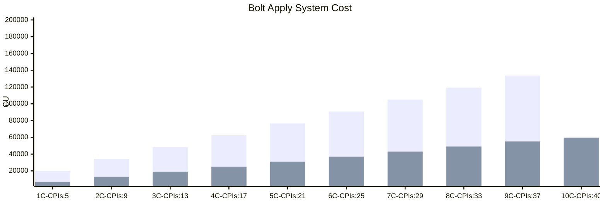

```mermaid
%%{init: {"xyChart": {"width": 1200, "height": 400, "xAxis": {}}}}%%
xychart
    title "Bolt Apply System Cost"
    x-axis ["1C-CPIs:5","2C-CPIs:9","3C-CPIs:13","4C-CPIs:17","5C-CPIs:21","6C-CPIs:25","7C-CPIs:29","8C-CPIs:33","9C-CPIs:37","10C-CPIs:40"]
    y-axis "CU" 5000 --> 200000
    bar [20119,34196,48290,62402,76546,90715,104998,119314,133655,0]
    bar [6919,12930,18924,24914,30908,36899,42976,49058,55137,59718]
```
