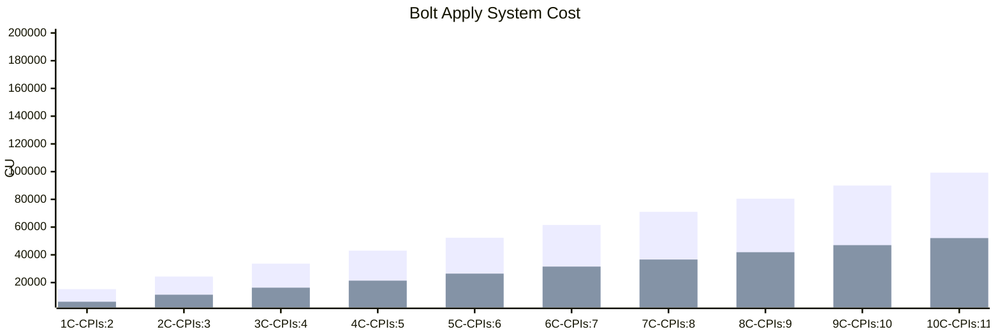

```mermaid
%%{init: {"xyChart": {"width": 1200, "height": 400, "xAxis": {}}}}%%
xychart
    title "Bolt Apply System Cost"
    x-axis ["1C-CPIs:2","2C-CPIs:3","3C-CPIs:4","4C-CPIs:5","5C-CPIs:6","6C-CPIs:7","7C-CPIs:8","8C-CPIs:9","9C-CPIs:10","10C-CPIs:11"]
    y-axis "CU" 5000 --> 200000
    bar [15254,24352,33653,43017,52358,61568,71006,80482,89958,99299]
    bar [6162,11236,16305,21374,26443,31516,36608,41892,46984,52077]
```
