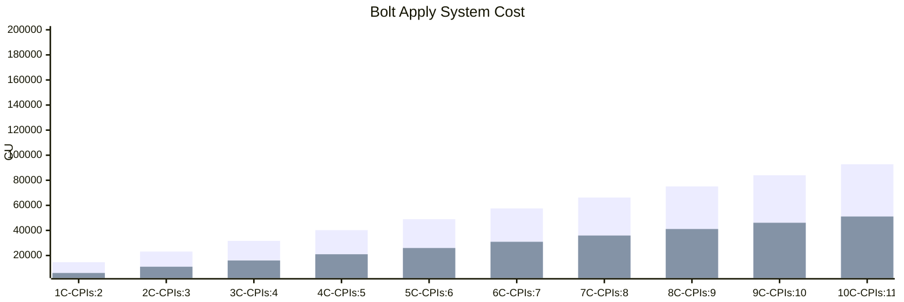

```mermaid
%%{init: {"xyChart": {"width": 1200, "height": 400, "xAxis": {}}}}%%
xychart
    title "Bolt Apply System Cost"
    x-axis ["1C-CPIs:2","2C-CPIs:3","3C-CPIs:4","4C-CPIs:5","5C-CPIs:6","6C-CPIs:7","7C-CPIs:8","8C-CPIs:9","9C-CPIs:10","10C-CPIs:11"]
    y-axis "CU" 5000 --> 200000
    bar [14633,23134,31660,40212,48956,57569,66228,75107,83986,92730]
    bar [6065,11042,16014,20986,25958,30934,35929,41116,46111,51107]
```
