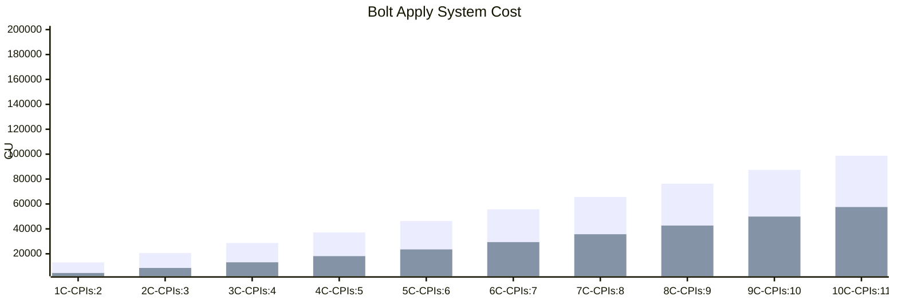

```mermaid
%%{init: {"xyChart": {"width": 1200, "height": 400, "xAxis": {}}}}%%
xychart
    title "Bolt Apply System Cost"
    x-axis ["1C-CPIs:2","2C-CPIs:3","3C-CPIs:4","4C-CPIs:5","5C-CPIs:6","6C-CPIs:7","7C-CPIs:8","8C-CPIs:9","9C-CPIs:10","10C-CPIs:11"]
    y-axis "CU" 5000 --> 200000
    bar [13110,20640,28678,37169,46306,55754,65697,76307,87375,98746]
    bar [4581,8633,13163,18120,23526,29382,35706,42669,49889,57556]
```
